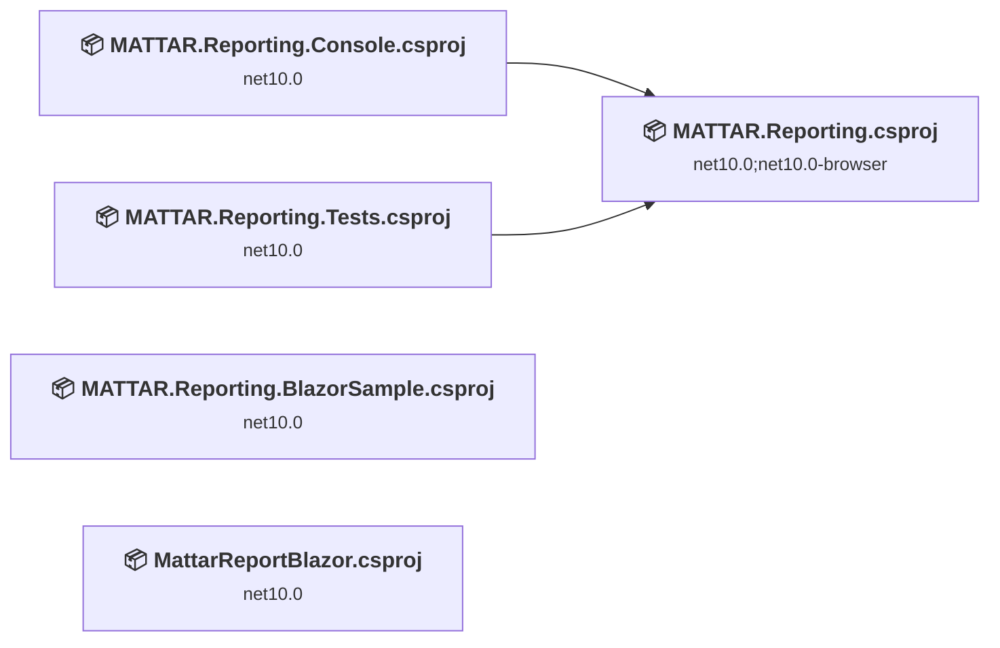
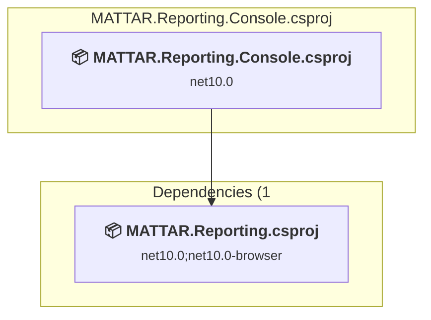
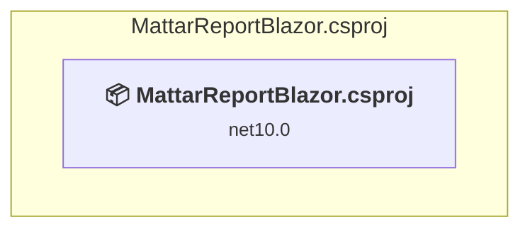
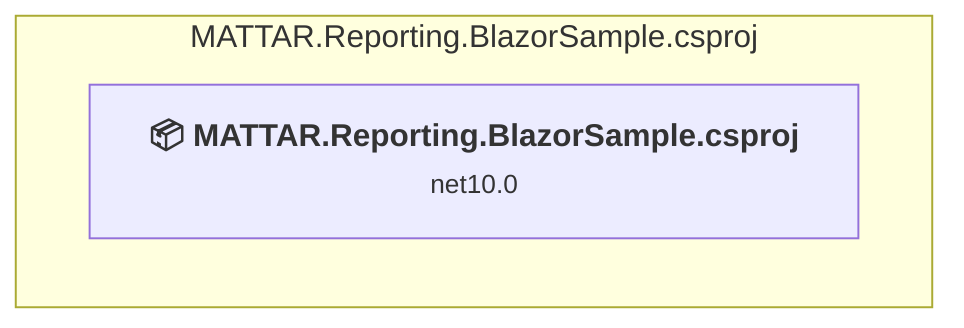
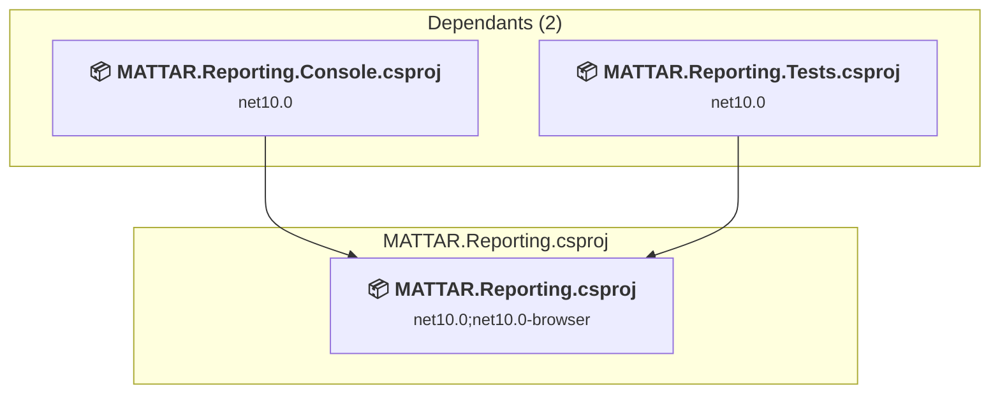
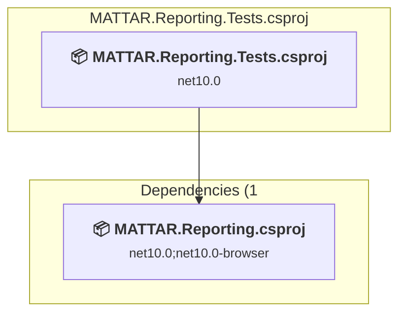

# Projects and dependencies analysis

This document provides a comprehensive overview of the projects and their dependencies in the context of upgrading to .NETCoreApp,Version=v11.0.

## Table of Contents

- [Executive Summary](#executive-Summary)
  - [Highlevel Metrics](#highlevel-metrics)
  - [Projects Compatibility](#projects-compatibility)
  - [Package Compatibility](#package-compatibility)
  - [API Compatibility](#api-compatibility)
- [Aggregate NuGet packages details](#aggregate-nuget-packages-details)
- [Top API Migration Challenges](#top-api-migration-challenges)
  - [Technologies and Features](#technologies-and-features)
  - [Most Frequent API Issues](#most-frequent-api-issues)
- [Projects Relationship Graph](#projects-relationship-graph)
- [Project Details](#project-details)

  - [sample\MATTAR.Reporting.Console.csproj](#samplemattarreportingconsolecsproj)
  - [samples\Blazor-Wasm\MattarReportBlazor.csproj](#samplesblazor-wasmmattarreportblazorcsproj)
  - [samples\MATTAR.Reporting.BlazorSample\MATTAR.Reporting.BlazorSample.csproj](#samplesmattarreportingblazorsamplemattarreportingblazorsamplecsproj)
  - [src\MATTAR.Reporting.csproj](#srcmattarreportingcsproj)
  - [tests\MATTAR.Reporting.Tests\MATTAR.Reporting.Tests.csproj](#testsmattarreportingtestsmattarreportingtestscsproj)

## Executive Summary

### Highlevel Metrics

| Metric | Count | Status |
| :--- | :---: | :--- |
| Total Projects | 5 | All require upgrade |
| Total NuGet Packages | 14 | 1 need upgrade |
| Total Code Files | 13 |  |
| Total Code Files with Incidents | 7 |  |
| Total Lines of Code | 1759 |  |
| Total Number of Issues | 12 |  |
| Estimated LOC to modify | 6+ | at least 0,3% of codebase |

### Projects Compatibility

| Project | Target Framework | Difficulty | Package Issues | API Issues | Est. LOC Impact | Description |
| :--- | :---: | :---: | :---: | :---: | :---: | :--- |
| [sample\MATTAR.Reporting.Console.csproj](#samplemattarreportingconsolecsproj) | net10.0 | 🟢 Low | 0 | 0 |  | DotNetCoreApp, Sdk Style = True |
| [samples\Blazor-Wasm\MattarReportBlazor.csproj](#samplesblazor-wasmmattarreportblazorcsproj) | net10.0 | 🟢 Low | 0 | 3 | 3+ | AspNetCore, Sdk Style = True |
| [samples\MATTAR.Reporting.BlazorSample\MATTAR.Reporting.BlazorSample.csproj](#samplesmattarreportingblazorsamplemattarreportingblazorsamplecsproj) | net10.0 | 🟢 Low | 0 | 3 | 3+ | AspNetCore, Sdk Style = True |
| [src\MATTAR.Reporting.csproj](#srcmattarreportingcsproj) | net10.0;net10.0-browser | 🟢 Low | 0 | 0 |  | ClassLibrary, Sdk Style = True |
| [tests\MATTAR.Reporting.Tests\MATTAR.Reporting.Tests.csproj](#testsmattarreportingtestsmattarreportingtestscsproj) | net10.0 | 🟢 Low | 1 | 0 |  | DotNetCoreApp, Sdk Style = True |

### Package Compatibility

| Status | Count | Percentage |
| :--- | :---: | :---: |
| ✅ Compatible | 13 | 92,9% |
| ⚠️ Incompatible | 1 | 7,1% |
| 🔄 Upgrade Recommended | 0 | 0,0% |
| ***Total NuGet Packages*** | ***14*** | ***100%*** |

### API Compatibility

| Category | Count | Impact |
| :--- | :---: | :--- |
| 🔴 Binary Incompatible | 0 | High - Require code changes |
| 🟡 Source Incompatible | 0 | Medium - Needs re-compilation and potential conflicting API error fixing |
| 🔵 Behavioral change | 6 | Low - Behavioral changes that may require testing at runtime |
| ✅ Compatible | 3495 |  |
| ***Total APIs Analyzed*** | ***3501*** |  |

## Aggregate NuGet packages details

| Package | Current Version | Suggested Version | Projects | Description |
| :--- | :---: | :---: | :--- | :--- |
| coverlet.collector | 10.0.0 |  | [MATTAR.Reporting.Tests.csproj](#testsmattarreportingtestsmattarreportingtestscsproj) | ✅Compatible |
| HtmlRenderer.PdfSharp.NetStandard2 | 1.5.1.3 |  | [MATTAR.Reporting.csproj](#srcmattarreportingcsproj) | ✅Compatible |
| MATTAR.Reporting | 1.1.0 |  | [MattarReportBlazor.csproj](#samplesblazor-wasmmattarreportblazorcsproj) | ✅Compatible |
| Microsoft.AspNetCore.Components.WebAssembly | 10.0.7 |  | [MATTAR.Reporting.BlazorSample.csproj](#samplesmattarreportingblazorsamplemattarreportingblazorsamplecsproj) [MattarReportBlazor.csproj](#samplesblazor-wasmmattarreportblazorcsproj) | ✅Compatible |
| Microsoft.AspNetCore.Components.WebAssembly.DevServer | 10.0.7 |  | [MATTAR.Reporting.BlazorSample.csproj](#samplesmattarreportingblazorsamplemattarreportingblazorsamplecsproj) [MattarReportBlazor.csproj](#samplesblazor-wasmmattarreportblazorcsproj) | ✅Compatible |
| Microsoft.NET.Test.Sdk | 18.5.1 |  | [MATTAR.Reporting.Tests.csproj](#testsmattarreportingtestsmattarreportingtestscsproj) | ✅Compatible |
| MigraDocCore.DocumentObjectModel | 1.3.67 |  | [MATTAR.Reporting.csproj](#srcmattarreportingcsproj) | ✅Compatible |
| MigraDocCore.Rendering | 1.3.67 |  | [MATTAR.Reporting.csproj](#srcmattarreportingcsproj) | ✅Compatible |
| PdfSharpCore | 1.3.67 |  | [MATTAR.Reporting.csproj](#srcmattarreportingcsproj) | ✅Compatible |
| Scriban | 7.1.0 |  | [MATTAR.Reporting.csproj](#srcmattarreportingcsproj) [MattarReportBlazor.csproj](#samplesblazor-wasmmattarreportblazorcsproj) | ✅Compatible |
| Shouldly | 4.3.0 |  | [MATTAR.Reporting.Tests.csproj](#testsmattarreportingtestsmattarreportingtestscsproj) | ✅Compatible |
| SixLabors.ImageSharp | 3.1.12 |  | [MATTAR.Reporting.Console.csproj](#samplemattarreportingconsolecsproj) [MATTAR.Reporting.csproj](#srcmattarreportingcsproj) [MATTAR.Reporting.Tests.csproj](#testsmattarreportingtestsmattarreportingtestscsproj) | ✅Compatible |
| xunit | 2.9.3 |  | [MATTAR.Reporting.Tests.csproj](#testsmattarreportingtestsmattarreportingtestscsproj) | ⚠️Le package NuGet est déconseillé |
| xunit.runner.visualstudio | 3.1.5 |  | [MATTAR.Reporting.Tests.csproj](#testsmattarreportingtestsmattarreportingtestscsproj) | ✅Compatible |

## Top API Migration Challenges

### Technologies and Features

| Technology | Issues | Percentage | Migration Path |
| :--- | :---: | :---: | :--- |

### Most Frequent API Issues

| API | Count | Percentage | Category |
| :--- | :---: | :---: | :--- |
| T:System.Uri | 4 | 66,7% | Behavioral Change |
| M:System.Uri.#ctor(System.String) | 2 | 33,3% | Behavioral Change |

## Projects Relationship Graph

Legend:
📦 SDK-style project
⚙️ Classic project

## Project Details

### sample\MATTAR.Reporting.Console.csproj

#### Project Info

- **Current Target Framework:** net10.0
- **Proposed Target Framework:** net11.0
- **SDK-style**: True
- **Project Kind:** DotNetCoreApp
- **Dependencies**: 1
- **Dependants**: 0
- **Number of Files**: 1
- **Number of Files with Incidents**: 1
- **Lines of Code**: 62
- **Estimated LOC to modify**: 0+ (at least 0,0% of the project)

#### Dependency Graph

Legend:
📦 SDK-style project
⚙️ Classic project

### API Compatibility

| Category | Count | Impact |
| :--- | :---: | :--- |
| 🔴 Binary Incompatible | 0 | High - Require code changes |
| 🟡 Source Incompatible | 0 | Medium - Needs re-compilation and potential conflicting API error fixing |
| 🔵 Behavioral change | 0 | Low - Behavioral changes that may require testing at runtime |
| ✅ Compatible | 103 |  |
| ***Total APIs Analyzed*** | ***103*** |  |

### samples\Blazor-Wasm\MattarReportBlazor.csproj

#### Project Info

- **Current Target Framework:** net10.0
- **Proposed Target Framework:** net11.0
- **SDK-style**: True
- **Project Kind:** AspNetCore
- **Dependencies**: 0
- **Dependants**: 0
- **Number of Files**: 17
- **Number of Files with Incidents**: 2
- **Lines of Code**: 450
- **Estimated LOC to modify**: 3+ (at least 0,7% of the project)

#### Dependency Graph

Legend:
📦 SDK-style project
⚙️ Classic project

### API Compatibility

| Category | Count | Impact |
| :--- | :---: | :--- |
| 🔴 Binary Incompatible | 0 | High - Require code changes |
| 🟡 Source Incompatible | 0 | Medium - Needs re-compilation and potential conflicting API error fixing |
| 🔵 Behavioral change | 3 | Low - Behavioral changes that may require testing at runtime |
| ✅ Compatible | 1122 |  |
| ***Total APIs Analyzed*** | ***1125*** |  |

### samples\MATTAR.Reporting.BlazorSample\MATTAR.Reporting.BlazorSample.csproj

#### Project Info

- **Current Target Framework:** net10.0
- **Proposed Target Framework:** net11.0
- **SDK-style**: True
- **Project Kind:** AspNetCore
- **Dependencies**: 0
- **Dependants**: 0
- **Number of Files**: 14
- **Number of Files with Incidents**: 2
- **Lines of Code**: 11
- **Estimated LOC to modify**: 3+ (at least 27,3% of the project)

#### Dependency Graph

Legend:
📦 SDK-style project
⚙️ Classic project

### API Compatibility

| Category | Count | Impact |
| :--- | :---: | :--- |
| 🔴 Binary Incompatible | 0 | High - Require code changes |
| 🟡 Source Incompatible | 0 | Medium - Needs re-compilation and potential conflicting API error fixing |
| 🔵 Behavioral change | 3 | Low - Behavioral changes that may require testing at runtime |
| ✅ Compatible | 440 |  |
| ***Total APIs Analyzed*** | ***443*** |  |

### src\MATTAR.Reporting.csproj

#### Project Info

- **Current Target Framework:** net10.0;net10.0-browser
- **Proposed Target Framework:** net10.0;net10.0-browser;net11.0;net11.0--browser
- **SDK-style**: True
- **Project Kind:** ClassLibrary
- **Dependencies**: 0
- **Dependants**: 2
- **Number of Files**: 4
- **Number of Files with Incidents**: 1
- **Lines of Code**: 371
- **Estimated LOC to modify**: 0+ (at least 0,0% of the project)

#### Dependency Graph

Legend:
📦 SDK-style project
⚙️ Classic project

### API Compatibility

| Category | Count | Impact |
| :--- | :---: | :--- |
| 🔴 Binary Incompatible | 0 | High - Require code changes |
| 🟡 Source Incompatible | 0 | Medium - Needs re-compilation and potential conflicting API error fixing |
| 🔵 Behavioral change | 0 | Low - Behavioral changes that may require testing at runtime |
| ✅ Compatible | 460 |  |
| ***Total APIs Analyzed*** | ***460*** |  |

### tests\MATTAR.Reporting.Tests\MATTAR.Reporting.Tests.csproj

#### Project Info

- **Current Target Framework:** net10.0
- **Proposed Target Framework:** net11.0
- **SDK-style**: True
- **Project Kind:** DotNetCoreApp
- **Dependencies**: 1
- **Dependants**: 0
- **Number of Files**: 5
- **Number of Files with Incidents**: 1
- **Lines of Code**: 865
- **Estimated LOC to modify**: 0+ (at least 0,0% of the project)

#### Dependency Graph

Legend:
📦 SDK-style project
⚙️ Classic project

### API Compatibility

| Category | Count | Impact |
| :--- | :---: | :--- |
| 🔴 Binary Incompatible | 0 | High - Require code changes |
| 🟡 Source Incompatible | 0 | Medium - Needs re-compilation and potential conflicting API error fixing |
| 🔵 Behavioral change | 0 | Low - Behavioral changes that may require testing at runtime |
| ✅ Compatible | 1370 |  |
| ***Total APIs Analyzed*** | ***1370*** |  |

